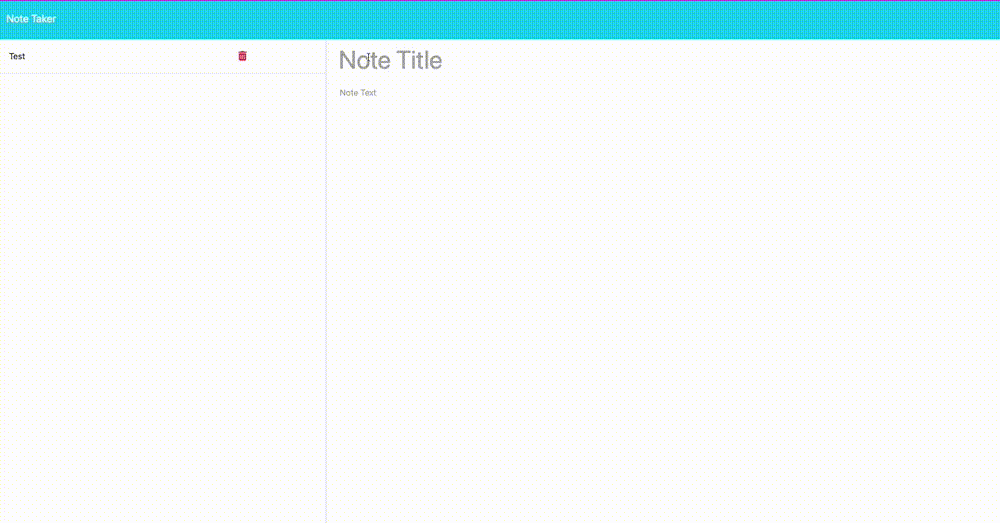

# Note Taker 
## Description
A note-taking web application that saves, creates, clears, and deletes notes.

## Table of Contents
*[Usage](#usage)  
*[Contributors](#contributors)  
*[Tests](#tests)  
*[Questions](#questions)    

## Usage
When a user accesses the landing page, they can click a button to go to the notes page. There are existing notes listed by title in the order they've been added on the left side, and empty fields for a note title and text on the left side. If they would like to clear what they've written or save their note, there are buttons on the top right. Once they've saved a note, it appears at the bottom of the column list on the left. Each note title there has a little trash button, that once clicked on, will delete the note permanently, and it disappears from the list. If a user is reading a note, they can click the new note button in the top right, and it will show them empty fields and the button disappears.
    
## License
The license for this project is: MIT.

## Contributors
Starter code and completion requirements were provided by the University of Pennsylvania in collaboration with EdX.
    
## Tests 
Inputting notes, deleting notes, starting a new note, and making sure the json file containing all of the notes matches user input.
    
## Questions
[Link to GitHub profile](github.com/dianamariedischer)

If you have more questions you can get in touch at dianamariedischer@gmail.com
